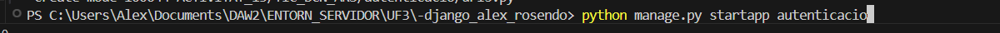
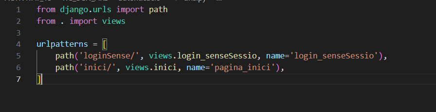
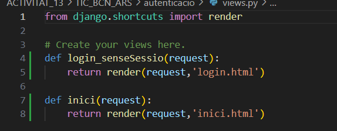
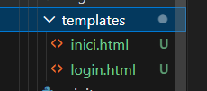
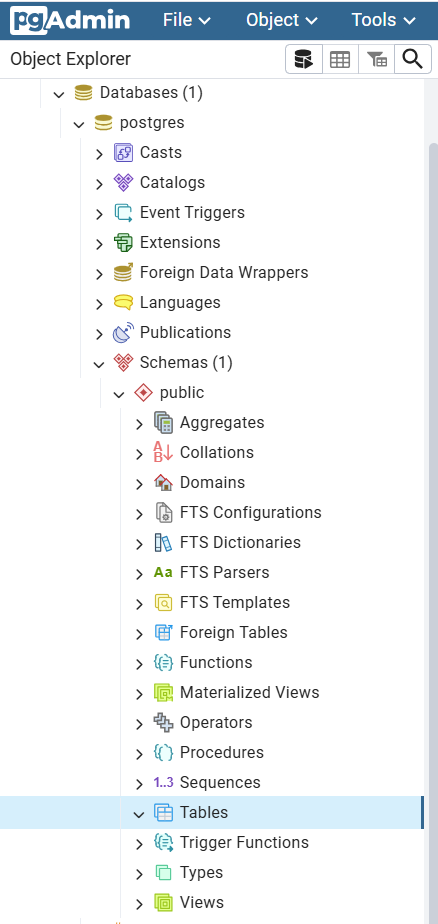
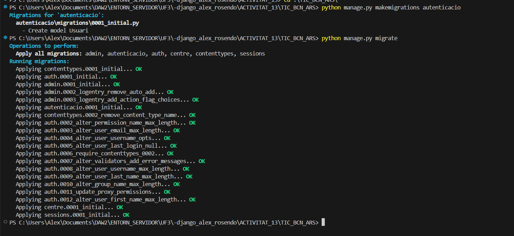
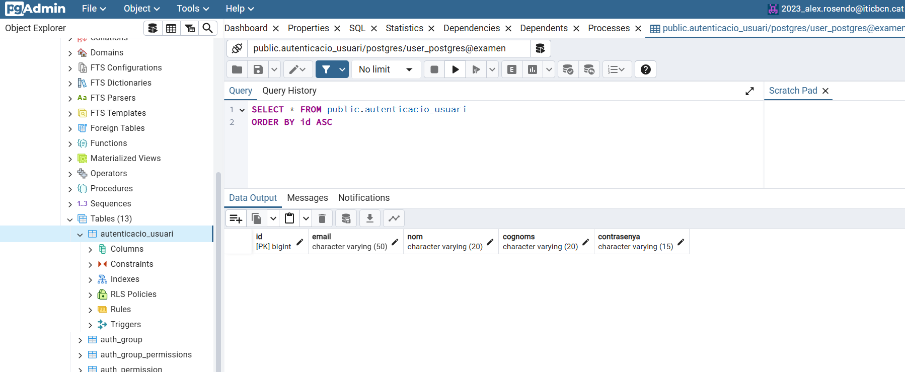

1. Configuració projecte:
    - settings:
        
        

2. Crear nova aplicacio:
    -  Comanda per crear l'aplicacio:  
    - urls app: 
    - views app: 
    - templates app:

3. Model Usuari:
    - Pgadmin abans de la migració: 
    - Comandes: 
    - Pgadmin després de les migracions: 